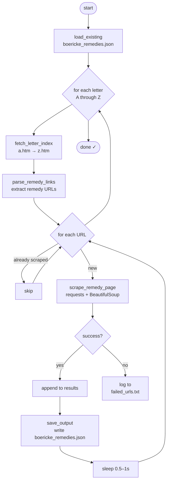
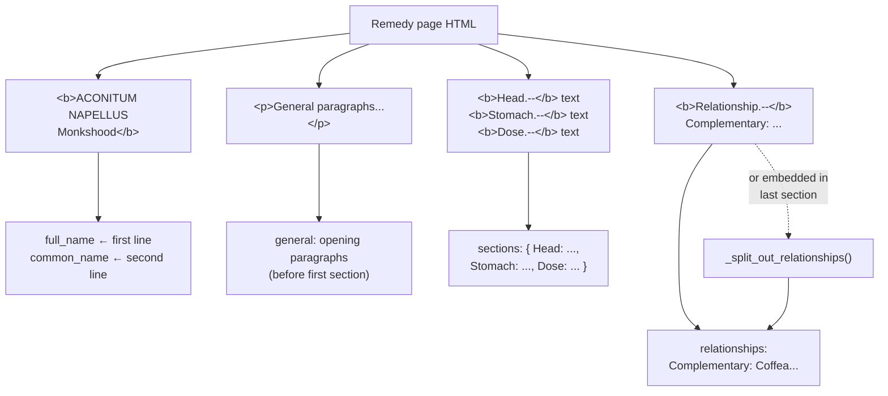

# Boericke's Materia Medica — Scraper

> Scrapes all ~680 remedy entries from [homeoint.org/books/boericmm](http://homeoint.org/books/boericmm/) and outputs a single clean, structured `boericke_remedies.json` — built for the jarvis.care AI clinical assistant.

---

## What it does

Crawls all **26 letter index pages** (A–Z), follows every remedy link, parses the clinical content, and writes a structured JSON dataset. The site is 1990s-era HTML with no semantic markup — so the parsing is entirely based on `<b>` tag patterns and DOM traversal logic.

No external scraping frameworks. Just `requests` + `BeautifulSoup` + some careful tree walking.



---

## Repo structure

```
├── scraper.py              # everything — fetching, parsing, CLI, MongoDB bonus
├── test_scraper.py         # 83 tests (unit + live integration)
├── requirements.txt        # requests, beautifulsoup4, pytest
├── boericke_remedies.json  # full A–Z output
├── sample_output.json      # 5-remedy sample for quick review
├── failed_urls.txt         # URLs that failed (empty = all good)
└── README.md
```

---

## Quickstart

```bash
# 1. clone and enter
git clone <repo-url> && cd boericke-scraper

# 2. virtual environment (recommended)
python -m venv .venv
source .venv/bin/activate       # Windows: .venv\Scripts\activate

# 3. install deps
pip install -r requirements.txt

# 4. run
python scraper.py
```

---

## CLI

```bash
# full A–Z scrape (~15–20 min with polite delays)
python scraper.py

# single letter — good for testing before committing to the full run
python scraper.py --letter A

# limit to first N remedies per letter — fastest smoke test
python scraper.py --letter A --limit 5

# resume an interrupted scrape — already-scraped URLs are skipped automatically
python scraper.py

# upload to MongoDB after scraping (bonus)
pip install pymongo
python scraper.py --upload
```

Progress output looks like this:

```
── Letter A ────────────────────────────────────────────────────────
  [A] Scraped 1/101 — ABIES CANADENSIS-PINUS CANADENSIS
  [A] Scraped 2/101 — ABIES NIGRA
  [A] Scraped 3/101 — ABRUS PRECATORIUS -- JEQUIRITY
  ...
  Letter A done — 101 new remedies scraped.

✓ Complete — 687 total remedies, 687 newly scraped → boericke_remedies.json
```

---

## Output schema

Each remedy in `boericke_remedies.json` looks like this:

```json
{
  "abbreviation": "ACON",
  "full_name": "ACONITUM NAPELLUS",
  "common_name": "Monkshood",
  "source_url": "http://homeoint.org/books/boericmm/a/acon.htm",
  "letter": "A",
  "general": "A state of fear, anxiety; anguish of mind and body...",
  "sections": {
    "Mind": "Great fear, anxiety, and worry accompany every ailment...",
    "Head": "Fullness; heavy, pulsating, hot, bursting headache...",
    "Dose": "Third to thirtieth potency."
  },
  "relationships": "Complementary: Coffea; Sulph. Compare: Bell, Cham."
}
```

| Field | Type | Notes |
|---|---|---|
| `abbreviation` | `string` | Uppercase index key, e.g. `ABIES-C` |
| `full_name` | `string` | Full Latin name from the page heading |
| `common_name` | `string \| null` | English name if present, else `null` |
| `source_url` | `string` | Direct link to the remedy page |
| `letter` | `string` | Single uppercase letter `A`–`Z` |
| `general` | `string` | Opening paragraphs before any section heading |
| `sections` | `object` | `{ "Head": "...", "Stomach": "..." }` — empty `{}` if none |
| `relationships` | `string \| null` | Cross-reference text; `null` if absent |

---

## Tests

```bash
# unit tests only — no network needed, runs in ~0.2s
pytest test_scraper.py -v -m "not integration"

# everything including live network tests
pytest test_scraper.py -v

# just the integration tests
pytest test_scraper.py -v -m integration
```

**83 tests** across 9 test classes:

| Class | What it covers |
|---|---|
| `TestCleanText` | Whitespace collapsing |
| `TestParseRemedyLinks` | Link extraction, deduplication, letter filtering |
| `TestExtractName` | Name + common name detection, boilerplate skipping |
| `TestFindSectionTags` | Section heading detection — `--`, `–`, `—` variants |
| `TestCollectTextFromTo` | DOM text traversal boundaries |
| `TestSplitOutRelationships` | Embedded `Complementary:` / `Compare:` mining |
| `TestSaveLoadOutput` | JSON I/O, resumability, corruption handling |
| `TestFullPipelineMockHTML` | Full pipeline with 3 mock pages (ABIES-C, ACON, ARS) |
| `TestOutputSchema` | All 8 required fields, correct types |
| `TestIntegration` | Live scrapes against the real site |

---

## How the parsing works

The site is vintage 1990s HTML — no semantic tags, no CSS classes. Structure comes entirely from `<b>` tag patterns.



**Name extraction**
The remedy name and common name are packed into the same `<b>` tag, separated by a newline: `"ACONITUM NAPELLUS\nMonkshood"`. The parser splits on newlines, checks the first line for all-caps, and takes the second line as the common name.

**Section detection**
Section headings match `SectionName.--` (e.g. `Head.--`, `Fever.--`). The tricky part: some pages (like Aconitum) have a malformed `<b></b>` immediately followed by a bare `<p>Mind.--text</p>`. The fix was switching from tag-level matching to **NavigableString-level matching** — scanning raw text nodes directly instead of inferring structure from container tags.

**Text collection**
`_collect_text_from_to(body, start, end)` walks `body.descendants` and collects NavigableStrings between two boundary nodes. Start nodes can be either a `Tag` (remedy name `<b>`) or a `NavigableString` (section heading text). When the start is a `Tag`, all descendants at any depth are skipped via ancestor-chain check — not just direct children, because some pages nest the heading text in a `<p>` inside the `<b>`.

**Relationships**
Two patterns exist across pages:
- Explicit `Relationship.--` section → captured directly
- No heading, but `Complementary:` / `Compare:` / `Antidotes:` embedded inside the last clinical section (Arsenicum does this) → surfaced by `_split_out_relationships()`

---

## Error handling

- **HTTP failures** — 3 retries with exponential backoff; prints `[RETRY 1/2]` on each attempt. Failed URLs are appended to `failed_urls.txt` and the scrape continues.
- **Malformed pages** — any field that can't be extracted returns `null` / `{}` rather than crashing.
- **Resumability** — on startup, `boericke_remedies.json` is loaded and indexed by `source_url`. Any URL already in there is skipped. Just re-run the same command after an interruption.

---

## MongoDB upload (bonus)

Requires a local MongoDB instance:

```bash
pip install pymongo
python scraper.py --upload
```

Pushes everything into `jarvis.remedies`. Uses `source_url` as the upsert key — safe to run multiple times, no duplicates.

---

## Dependencies

| Package | Why |
|---|---|
| `requests` | HTTP with timeout + retry support |
| `beautifulsoup4` | HTML parsing with `html.parser` (stdlib backend, no compiled deps) |
| `pytest` | Test runner |
